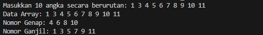
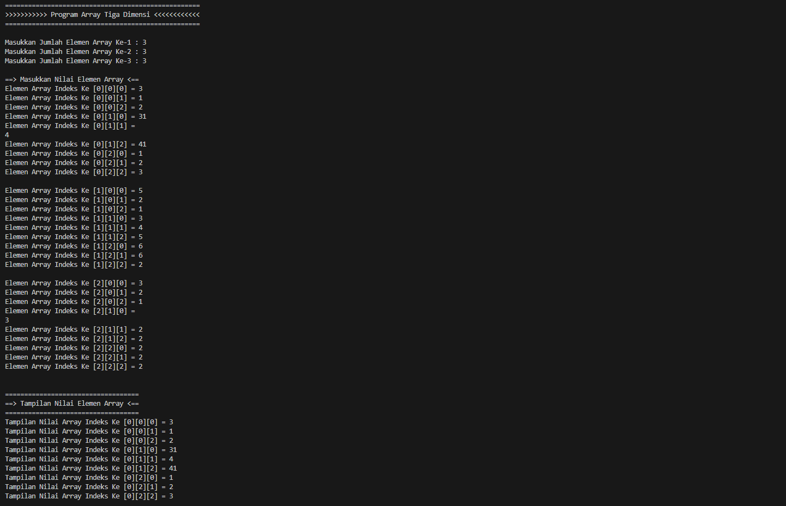
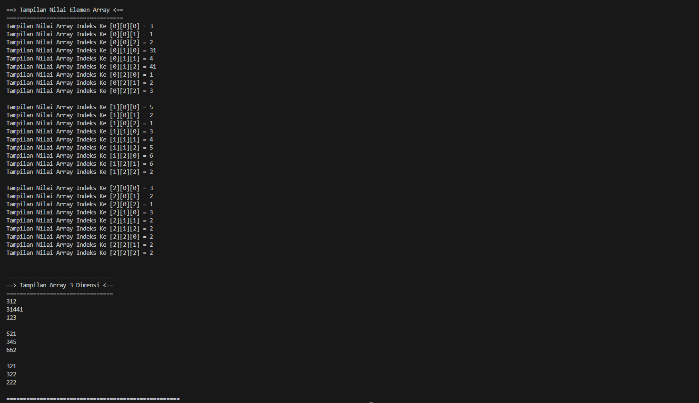
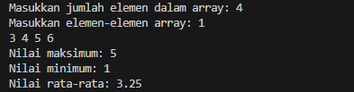

# <h1 align="center">Laporan Praktikum Modul Array</h1>
<p align="center">Ikram Iriansyah - 2311102184</p>

## Dasar Teori
Array adalah struktur data yang digunakan untuk menyimpan banyak data dalam satu tempat dan memiliki indeks untuk setiap data, sehingga mudah diprosest. Tetapi array hanya dapat mendeklarasikan 1 tipe data. <br/>
1. Array 1 dimensi
Array Satu dimensi tidak lain adalah kumpulan elemen-elemen identik yang tersusun dalam satu baris. Elemen-elemen tersebut memiliki tipe data yang sama, tetapi isi dari elemen tersebut dapat berbeda. Petunjuk indeks hanya satu. <br/>

2. Array 2 dimensi : Matriks
Matriks adalah sekumpulan informasi yang setiap individu elemennya diacu dengan menggunakan dua buah indeks (yang biasanya dikonotasikan dengan baris dan kolom).<br/>

3. Array Multidimensi
Array multidimensi digunakan untuk mewakili array dengan dimensi lebih dari dua atau lebih, meskipun mereka memiliki kesamaan dengan array satu dimensi dan dua dimensi. Array yang memiliki lebih dari dua indeks; ini dapat berupa array tiga dimensi, empat dimensi, dll.

## Guided 

### 1. [Program Input Array Tiga Dimensi]

```C++
#include <iostream>
using namespace std;


int main (){
    int arr [2] [3] [3];
     for (int x = 0; x < 2; x++){
        for (int y = 0; y < 3 ; y++){
            for (int z = 0; z < 3; z++)
            {
                cout << "Input Array [" << x << "][" << y << "][" << z << "] = ";

                cin >> arr [x][y][z];
            }
            
        }
        cout << endl;
     }
     
     for (int x = 0; x < 2; x++){
        for (int y = 0; y < 3; y++){
            for (int z = 0; z < 3; z++){
                cout << "Data Array [" << x << "][" << y << "][" << z << "] = " << arr [x][y][z] << endl;
            }
        }
     }

     cout << endl;

     for (int x = 0; x < 2; x++){
        for (int y = 0; y < 3; y++){
            for (int z = 0; z < 3; z++){
                cout << arr[x][y][z] << ends;
            }
            cout << endl;
        }
        cout << endl;
     }

     return 0;
     
}
```
Cara kerja array tiga dimensi (3D) untuk menyimpan dan memproses data ditunjukkan dalam kode C++ ini. Dimulai dengan deklarasi array arr integer dengan dimensi 2x3x3, yang berarti memiliki 2 "lapisan", 3 "baris", dan 3 "kolom" di setiap baris. Ini menghasilkan array dengan 18 elemen total. Loop untuk berlapis lainnya digunakan untuk iterasi melalui array. Informasi elemen array, termasuk indeks dan nilai, dicetak dengan format yang tepat di dalam loop.

### 2. [Program Mencari Nilai Maksimal pada Array]
```C++
#include <iostream>
using namespace std;

int main(){
    int maks, a, i = 1, lokasi;
    cout << "Masukan Panjang Array: ";
    cin >> a;
    int array[a];
    cout << "Masukkan " << a << " angka\n";

    for (i = 0; i < a; i++){
        cout << "Array ke-" << (i) << ": ";
        cin >> array[i];
    }
    maks = array[0];

    for (i = 0; i < a; i++){
        if (array[i] > maks){
            maks = array[i];
            lokasi = i;
        }
    }

    cout << "Nilai maksimum adalah " << maks << " berada di array ke " << lokasi << endl;

    return 0;
}
```
Program di atas adalah sebuah program C++ yang meminta pengguna untuk memasukkan panjang array, diikuti dengan memasukkan angka-angka untuk diisi ke dalam array tersebut. Selanjutnya, program mencari nilai maksimum dari angka-angka yang dimasukkan ke dalam array dan menampilkan nilai maksimum tersebut beserta dengan indeks (lokasi) di mana nilai maksimum tersebut ditemukan dalam array. Hal ini dilakukan dengan menggunakan dua loop: satu untuk meminta pengguna memasukkan angka-angka ke dalam array dan yang lainnya untuk mencari nilai maksimum dan lokasinya dalam array.

## Unguided 

### 1. [Buatlah program untuk menampilkan Output seperti berikut dengan data yang diinputkan oleh user!]
```C++
#include <iostream>

using namespace std;

int main() {
    const int SIZE = 10;
    int data[SIZE];
    int genap[SIZE], ganjil[SIZE];
    int genap_count = 0, ganjil_count = 0;

    // Input data dari pengguna
    cout << "Masukkan 10 angka secara berurutan: ";
    for (int i = 0; i < SIZE; ++i) {
        cin >> data[i];
    }

    // Memisahkan nomor genap dan ganjil
    for (int i = 0; i < SIZE; ++i) {
        if (data[i] % 2 == 0) {
            genap[genap_count++] = data[i];
        } else {
            ganjil[ganjil_count++] = data[i];
        }
    }

    // Menampilkan data array
    cout << "Data Array: ";
    for (int i = 0; i < SIZE; ++i) {
        cout << data[i] << " ";
    }
    cout << endl;

    // Menampilkan nomor genap
    cout << "Nomor Genap: ";
    for (int i = 0; i < genap_count; ++i) {
        cout << genap[i] << " ";
    }
    cout << endl;

    // Menampilkan nomor ganjil
    cout << "Nomor Ganjil: ";
    for (int i = 0; i < ganjil_count; ++i) {
        cout << ganjil[i] << " ";
    }
    cout << endl;

    return 0;
}
```
#### Output:


Kode Program C++ di atas meminta pengguna untuk memasukkan sepuluh angka secara berurutan, kemudian memisahkan angka-angka tersebut menjadi dua kelompok: angka genap dan angka ganjil. Kemudian, program menampilkan kembali seluruh data array dan menampilkan masing-masing angka genap dan ganjil secara terpisah. Ini dilakukan dengan menggunakan array dan iterasi melalui data array untuk membedakan angka genap dan ganjil dari satu sama lain.

### 2. [Buatlah program Input array tiga dimensi (seperti pada guided) tetapi jumlah atau ukuran elemennya diinputkan oleh user!]
```C++
#include <iostream>

using namespace std;

int main()
{
    int a, b, c;

    cout << "===================================================\n";
    cout << ">>>>>>>>>>> Program Array Tiga Dimensi <<<<<<<<<<<<\n";
    cout << "===================================================\n";
    cout << endl;

    cout << "Masukkan Jumlah Elemen Array Ke-1 : ";
    cin >> a;
    cout << "Masukkan Jumlah Elemen Array Ke-2 : ";
    cin >> b;
    cout << "Masukkan Jumlah Elemen Array Ke-3 : ";
    cin >> c;
    cout << endl;

    // Input nilai elemen array
    int arr [a][b][c];
    cout << "==> Masukkan Nilai Elemen Array <==\n";

    for(int i=0; i<a; i++){
        for(int j=0; j<b; j++){
            for(int k=0; k<c; k++){
                cout << "Elemen Array Indeks Ke [" << i << "][" << j << "][" << k << "] = ";
                cin >> arr[i][j][k];
            }
        }
        cout << endl;
    }

    cout << "\n===================================\n";
    cout << "==> Tampilan Nilai Elemen Array <==\n";
    cout << "===================================\n";

    //Menampilkan nilai yang kita inputkan
    for(int i=0; i<a; i++){
        for(int j=0; j<b; j++){
            for(int k=0; k<c; k++){
                cout << "Tampilan Nilai Array Indeks Ke [" << i << "][" << j << "][" << k << "] = "<< arr[i][j][k] << endl;
            }
        }
        cout << endl;
    }

    cout << "\n================================\n";
    cout << "==> Tampilan Array 3 Dimensi <==\n";
    cout << "================================\n";

    //Tampilan array
    for (int i=0; i<a; i++){
        for (int j=0; j<b; j++){
            for (int k=0; k<c; k++){
                cout << arr[i][j][k] << ends;
            }
            cout << endl;
        }
        cout << endl;
    }

    cout << "===================================================="<< endl;

    return 0;
}
```

#### Output



Program C++ di atas memungkinkan pengguna untuk memasukkan jumlah elemen untuk array tiga dimensi dan nilai-nilai elemen tersebut. Kemudian program menampilkan nilai-nilai elemen array yang dimasukkan dalam format yang terstruktur menurut indeksnya dan kemudian dalam bentuk tampilan array tiga dimensi. Untuk mengakses dan menampilkan nilai-nilai elemen, tiga loop bersarang digunakan.

### 3. [Buatlah program menu untuk mencari nilai Maksimum, Minimum dan Nilai rata – rata dari suatu array dengan input yang dimasukan oleh user!]

```C++
#include <iostream>

using namespace std;

int main() {
    int size;
    cout << "Masukkan jumlah elemen dalam array: ";
    cin >> size;

    // Memastikan ukuran array tidak negatif atau nol
    if (size <= 0) {
        cout << "Ukuran array harus lebih besar dari 0." << endl;
        return 1;
    }

    int array[size];
    cout << "Masukkan elemen-elemen array: ";
    for (int i = 0; i < size; ++i) {
        cin >> array[i];
    }

    // Inisialisasi nilai maksimum dan minimum dengan elemen pertama array
    int max = array[0];
    int min = array[0];
    int sum = 0;

    // Mencari nilai maksimum, minimum, dan menghitung jumlah elemen
    for (int i = 0; i < size; ++i) {
        if (array[i] > max) {
            max = array[i];
        }
        if (array[i] < min) {
            min = array[i];
        }
        sum += array[i];
    }

    // Menghitung rata-rata
    float average = static_cast<float>(sum) / size;

    // Menampilkan hasil
    cout << "Nilai maksimum: " << max << endl;
    cout << "Nilai minimum: " << min << endl;
    cout << "Nilai rata-rata: " << average << endl;

    return 0;
}
```
#### Output:


Program di atas adalah sebuah program C++ yang mengambil input dari pengguna untuk menentukan ukuran array dan elemen-elemen array. Setelah itu, program ini mencari nilai maksimum, minimum, dan rata-rata dari elemen-elemen array tersebut. <br/>

Pertama, pengguna diminta untuk memasukkan jumlah elemen dalam array. Kemudian, program memeriksa apakah ukuran array yang dimasukkan tidak negatif atau nol. Jika ukuran array tidak sesuai, program akan memberikan pesan kesalahan dan berhenti. <br/>

Selanjutnya, pengguna diminta untuk memasukkan elemen-elemen array. Program akan menyimpan elemen-elemen ini dalam array yang sesuai. <br/>

Setelah itu, program mencari nilai maksimum, minimum, dan menghitung jumlah semua elemen dalam array dengan menggunakan loop. <br/>

Selanjutnya, program menghitung rata-rata elemen-elemen array dengan membagi jumlah total elemen dengan ukuran array. <br/>

Terakhir, program menampilkan nilai maksimum, minimum, dan rata-rata elemen-elemen array tersebut kepada pengguna. <br/>


## Kesimpulan
Array adalah struktur data yang digunakan untuk menyimpan banyak data dalam satu tempat dan memiliki indeks untuk setiap data, sehingga mudah diproses. Selain itu, array membantu pengguna menyimpan dan mengorganisir data serta memberikan akses mudah ke data melalui indeksnya.

## Referensi
[1] Sindar, Anita, STRUKTUR DATA DAN ALGORITMA DENGAN C++. 1st Edisi. Serang:CV.AA.RIZKY,2018.<br/>
[2] Suprapto, Kadarisman Tejo Yuwono, Totok Sukardiyono, dan Adi Dewanto, BAHASA PEMROGRAMAN untuk Sekolah Menengah Kejuruan. Departemen Pendidikan Nasional, 2008.